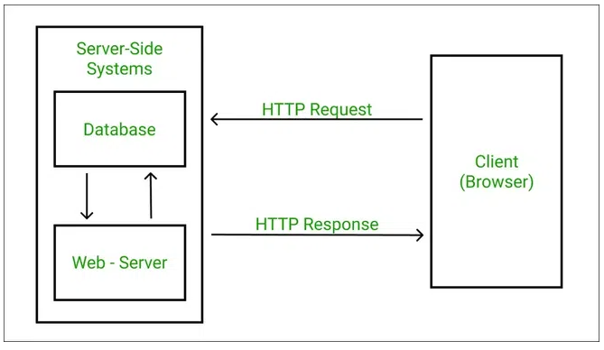
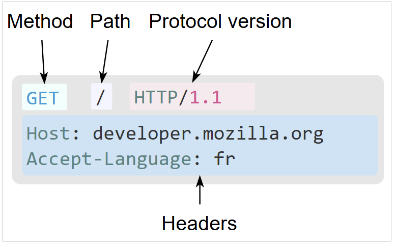
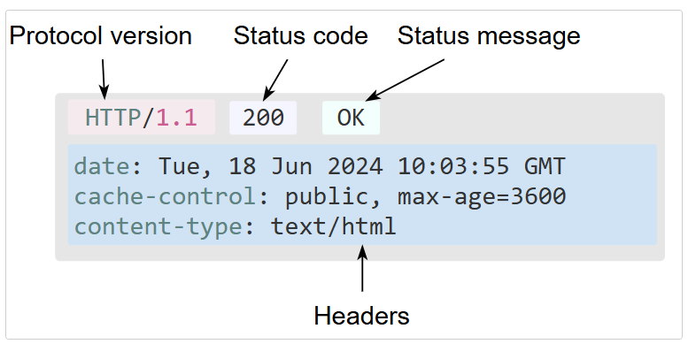

# HTTP Basics

## HTTP
- Hypertext Transfer Protocol  
- HTTP is a protocol used for communicating between clients (web browsers, API) and servers  
- It defines how web browsers and servers exchange information  

# HTTP Communication

## What does response style protocol mean?
- Refers to the structure of HTTP responses (status line, headers, and body)  
- Ensures consistent formatting so clients can understand and process server responses  
- Common in web frameworks to control how responses are styled (e.g. JSON vs. HTML)

## Statelessness
- Statelessness means that each request from a client to a server is independent  
- No information is retained by the server about previous requests made by the client
- Each call contains all the data necessary to complete itself successfully

## HTTP request Structure
- HTTP request is a message sent from a client to a server  
- Common methods: GET, POST, PUT, DELETE, PATCH, CONNECT  
- `/` Path to the resource e.g. `/gocompare.html`  
- `HTTP/1.1` protocol version  

## HTTP response Structure
- HTTP response is what a server sends back to a client (browser or API)  
- Includes a status line, headers, and an optional body  
- The body can contain HTML, JSON, images, etc.  

---

# Cookies and Sessions

## What are cookies?
- Small key-value data stored by the browser  
- Sent with every request to the same domain  

## What are cookies used for?
- Storing user preferences or login status  
- Session management  
- Tracking user activity (e.g. for analytics or ads)  

## Bonus: What is a session?
- A session stores data about a user's interaction with a site on the server side  
- Usually linked to a session ID stored in a cookie  
- Enables persistent login and state across multiple requests  

---

# Status Codes and Methods

## What are the different types of HTTP status code?
- 1xx – Informational (e.g. 100 Continue)  
- 2xx – Success (e.g. 200 OK, 201 Created)  
- 3xx – Redirection (e.g. 301 Moved Permanently, 302 Found)  
- 4xx – Client Error (e.g. 400 Bad Request, 404 Not Found)  
- 5xx – Server Error (e.g. 500 Internal Server Error, 503 Service Unavailable)  

## What are the HTTP CRUD methods?
- `GET` – Read data  
- `POST` – Create new data  
- `PUT` – Update/replace existing data  
- `PATCH` – Partially update data  
- `DELETE` – Delete data  

## What is CRUD?
- An acronym for the four basic operations of persistent storage:
  - Create  
  - Read  
  - Update  
  - Delete  

---

# Domain and Security

## What is DNS?
- Domain Name System  
- Translates domain names (like `example.com`) into IP addresses that computers use  

## What is the difference between HTTP and HTTPS?
- HTTP is unencrypted, while HTTPS is encrypted using SSL/TLS  
- HTTPS protects data from being intercepted or tampered with  
- HTTPS is essential for secure transactions, like payments or logins  

## Bonus: What is an SSL certificate?
- A digital certificate that confirms a website’s identity  
- Enables secure (encrypted) connections using HTTPS  
- Issued by a trusted Certificate Authority (CA)  

---

# APIs and REST

## What is a REST API?
- An API that follows the principles of Representational State Transfer (REST)  
- Uses standard HTTP methods to access and manipulate resources  

## What makes an API Restful?
- Uses HTTP methods properly (GET, POST, etc.)  
- Stateless – each request is independent  
- Resource-based URLs (e.g. `/users/123`)  
- Returns data in standard formats like JSON  
- Uses appropriate HTTP status codes  

## What is an API Key?
- A unique identifier used to authenticate and authorize a client using an API  
- Often required in headers or query strings for access  

## What are some examples of REST APIs you may encounter in everyday life without knowing?
- Weather apps using weather APIs  
- Maps and navigation apps using Google Maps API  
- E-commerce sites using payment APIs like Stripe or PayPal  
- Social media platforms fetching posts, likes, or messages via APIs

## Rest Concepts

## Rest API's (Representational State Transfer)
- Application programming interface that conforms to the design principles of the Representational State Transfer
---