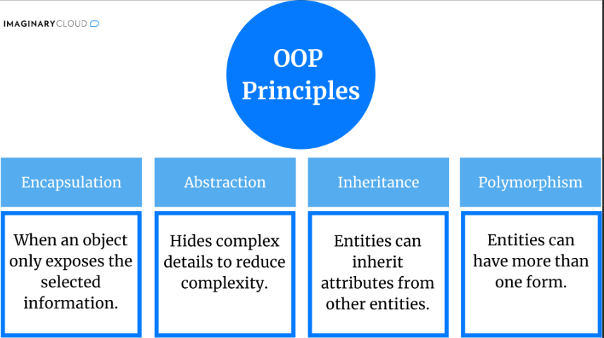
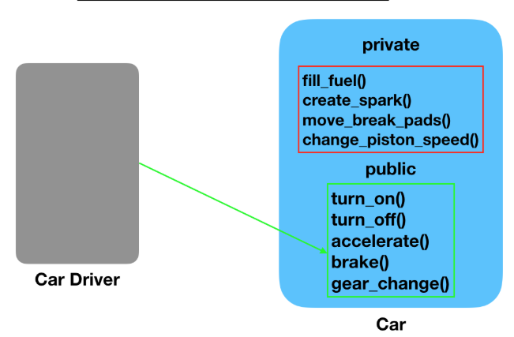
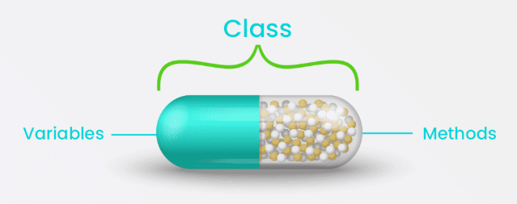
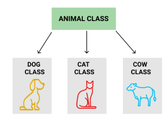
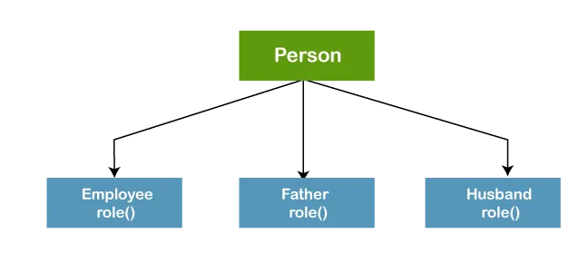

# OBJECT ORIENTED PROGRAMMING (OOP)

### OOP is a type of programming paradigm that consists of using classes and objects to structre the program

### 4 Principles to define OOP (Encapsualtion, Inheretance, Polymorphism, Abstraction)

### A class is a blueprint for creating objects. It defines the attributes and methods
- classStudent
- first_name
- surname
- age
- methods ()

### A object is an instance of a class 
#### (This is called an instance which abstracts from the class)
- myStudent = ClassStudent(first_name =)
- print(myStudent.first_name)

## Abstraction
#### Abstrction is a concept used in OOP which aims to handle complexity by hiding unecessary details from the user. 
- This is done through using abstract classes

## Encapsulation
#### Encapsulation is a concept used in OOP which is essentially bundling of data and methods/ variables like a class
#### Encapsulating the data, variables and methods

## Inheritance
### Inheritance is a concept used in OOP to obtain attributes from the main class to make a sub-class
- Class Animal:
- Class Dog(Animal):

## Polymorphism
### Polymorphism is a concept in OOP which describes the ability for an object to have more than on realisation
- Use of a function used in multiple instances

